# 图书管理系统原型设计

## 1. 系统架构图

### 1.1 系统整体架构

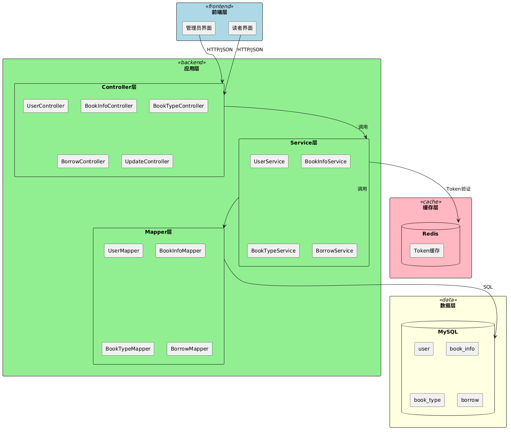

---

## 2. 数据库设计

### 2.1 ER图

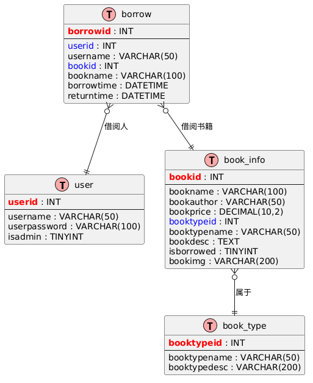

---

## 3. 用例图

### 3.1 管理员用例图

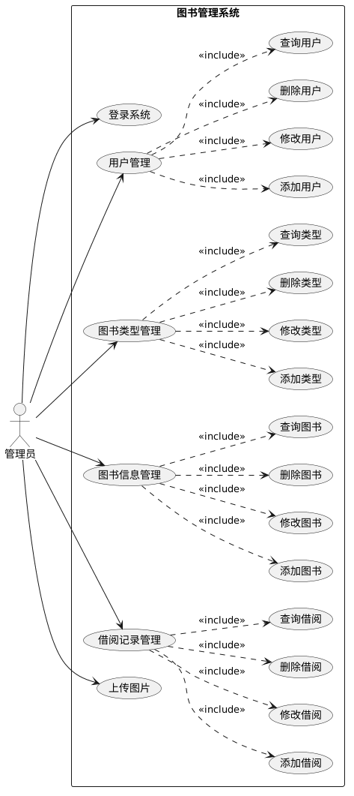

### 3.2 读者用例图

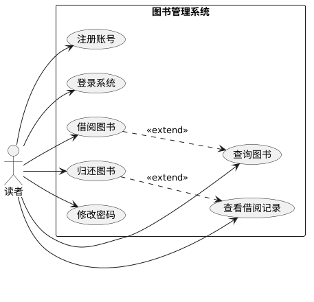

---

## 4. 时序图

### 4.1 用户登录时序图

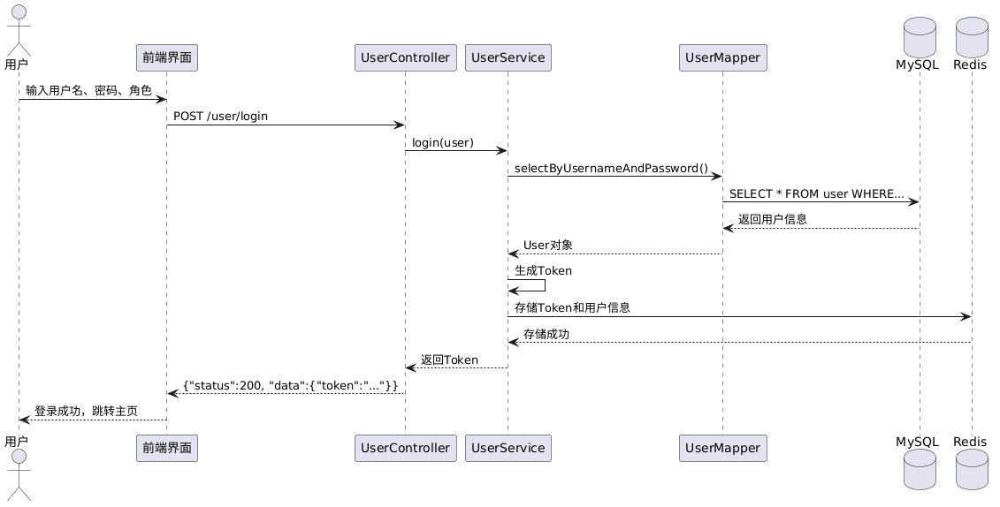

### 4.2 借书流程时序图

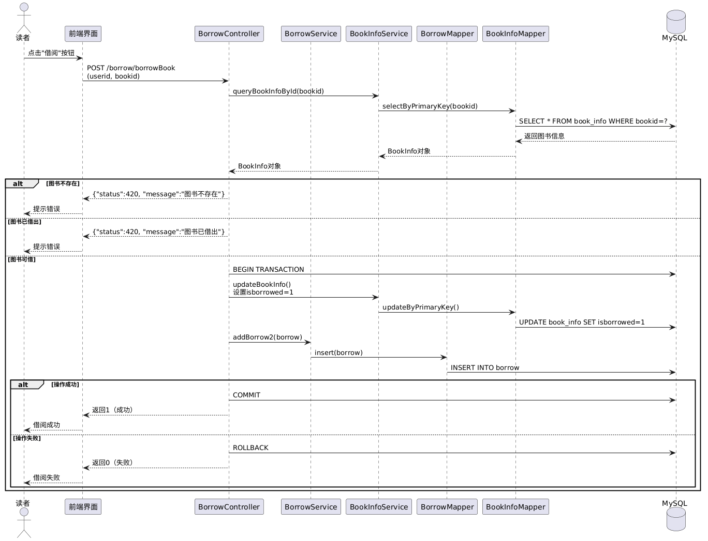

### 4.3 还书流程时序图

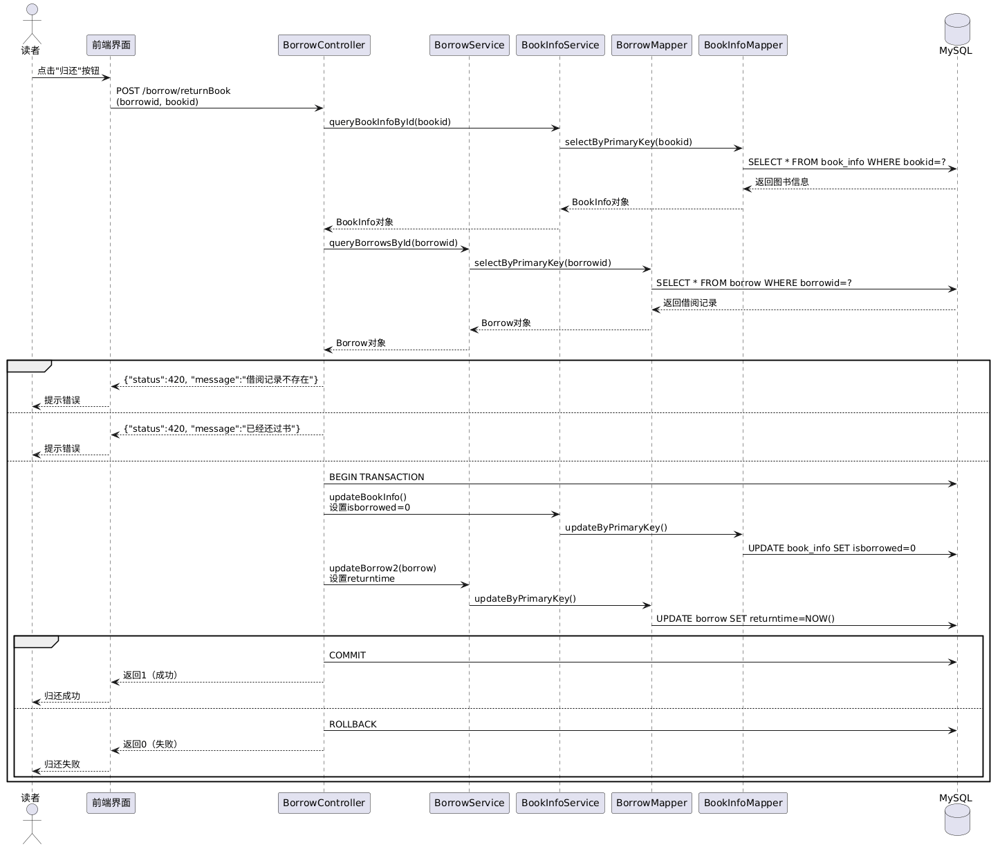

---

## 5. 状态图

### 5.1 图书状态图

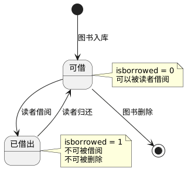

### 5.2 借阅记录状态图

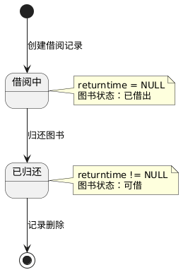

### 5.3 用户会话状态图

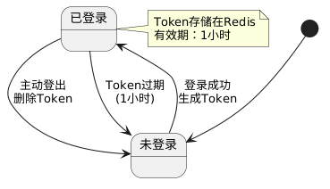

---

## 6. 活动图

### 6.1 用户注册流程

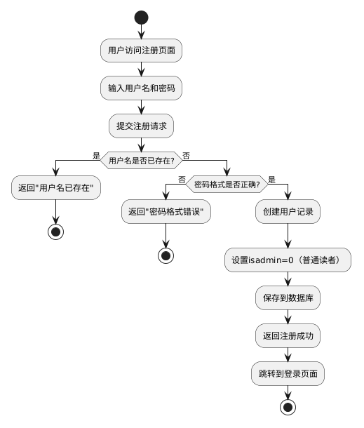

### 6.2 图书搜索流程

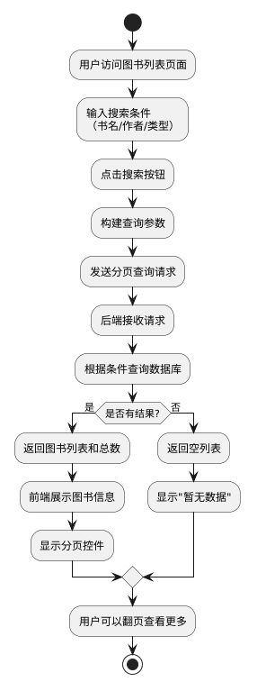

### 6.3 管理员添加图书流程

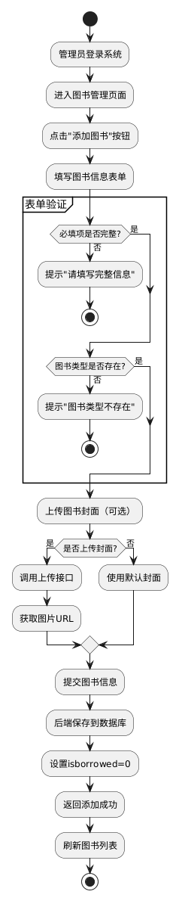

---

## 7. 组件图

### 7.1 系统组件图

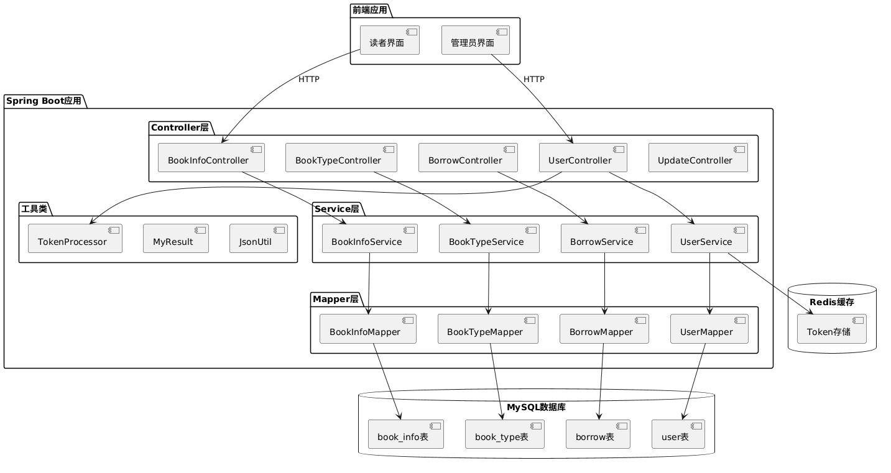

---

## 8. 部署图

### 8.1 系统部署图

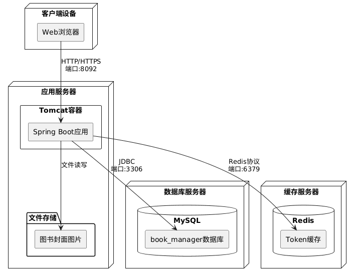

---

## 9. 类图

### 9.1 实体类图

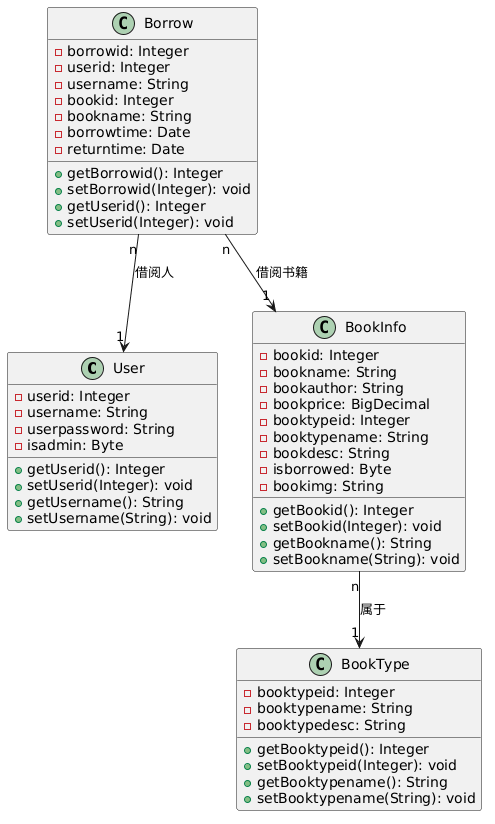

### 9.2 Service层类图

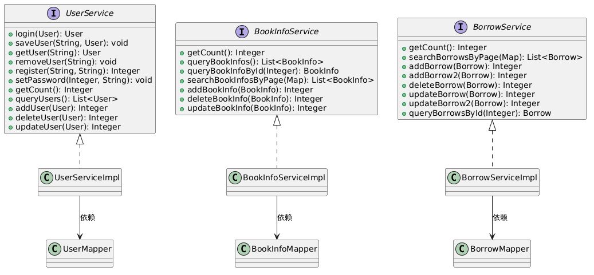

---

**文档版本**：v1.0
**最后更新**：2026-03-22
